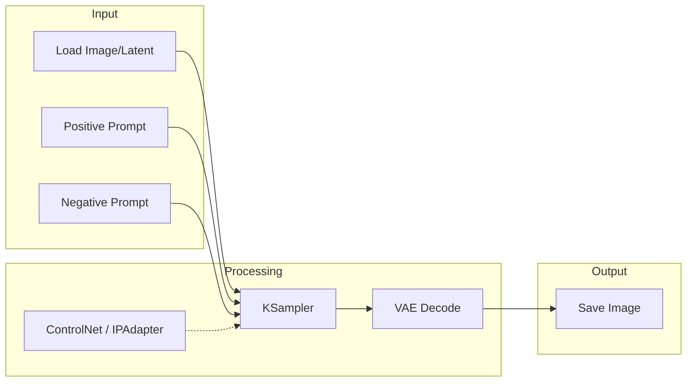
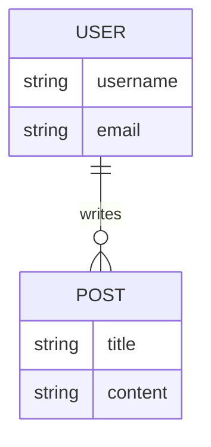
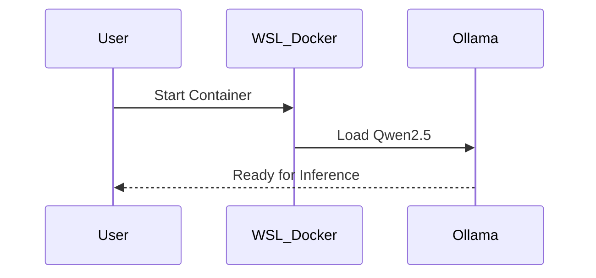
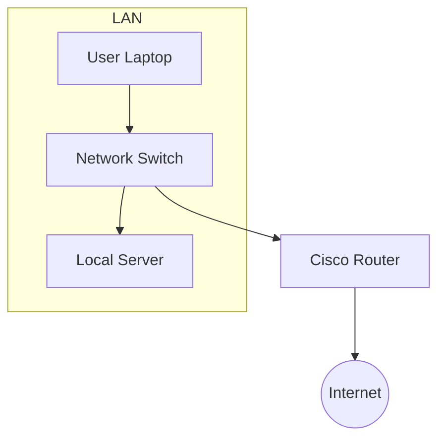
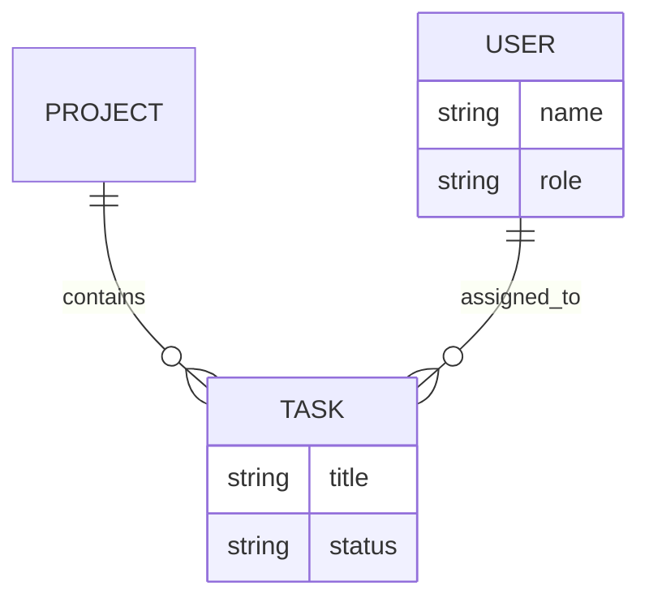

# Server Settings & Docker Orchestration

This repository contains the configuration and orchestration scripts for my local services, including ComfyUI and networking tools.

## 🏗 Structure

- `/data`: Persistent storage for all services (ignored by git).
- `/old_2_dc`: Archive of previous configuration files for reference.
- `services-up.sh`: Bootstraps the environment and starts containers.
- `services-down.sh`: Safely stops all active services.

## 🚀 Getting Started

### Prerequisites
- Docker & Docker Compose
- Tailscale (for remote access)

### Usage
To start the services with the correct environment variables (setting the `BASE_DIR` for volume persistence):

```bash
chmod +x services-up.sh services-down.sh
./services-up.sh
```

Final Checklist:

1. Network: Verify all containers are on the same bridge network in `docker-compose` so `qdrant-mcp` can see `qdrant` by hostname.

2. Continue Config: Check that `config.yaml` uses `role: [chat, autocomplete]` correctly for your Ollama models.

3. Permissions: If you encounter errors writing to the `combined` folder from inside Docker, run `chmod -R 777` on your local data volumes (_common WSL/Docker permission quirk_).

## ComfyUI

Based on your setup and the specific models you have pulled (especially the **Qwen2.5-Coder** and **Gemma3** models), I've reviewed the logical flow for your ComfyUI-Workflows.

Since you are using **Ollama** within a WSL Docker container, ensure your ComfyUI instance (also in Docker) is on the same network so it can call the Ollama API for prompt expansion or "LLM-to-Image" logic.

### 1. Connecting the Nodes

For the workflows in your `ComfyUI-Workflows` folder to function, they follow a standard "graph" logic. If you are building these from scratch or fixing broken links, follow this standard connection path:

* **Load Checkpoint** `MODEL` -> **KSampler** `model`
* **Load Checkpoint** `CLIP` -> **CLIP Text Encode** `clip`
* **CLIP Text Encode (Positive)** `CONDITIONING` -> **KSampler** `positive`
* **CLIP Text Encode (Negative)** `CONDITIONING` -> **KSampler** `negative`
* **Empty Latent Image** `LATENT` -> **KSampler** `latent_image`
* **KSampler** `LATENT` -> **VAE Decode** `samples`
* **Load Checkpoint** `VAE` -> **VAE Decode** `vae`
* **VAE Decode** `IMAGE` -> **Save Image** `images`

---

### 2. Sample Prompts for Your Use Cases

Given your local models (like `llama3.1` or `qwen2.5-coder`), you can use them to generate these specific prompts or use the ones below directly in your **CLIP Text Encode** nodes.

#### Meme Generation (Absurdist/Viral)

* **Prompt:** `A dramatic oil painting of a cat wearing a tiny crown and holding a scepter, sitting on a throne made of cardboard boxes, cinematic lighting, 8k, funny internet meme style.`
* **Negative:** `blurry, low quality, distorted paws, serious, dark.`

#### Meme with Text Generation

* **Note:** Use the **Custom Nodes** (like `ComfyUI-VideoHelperSuite` or `TextImage`) to overlay text.
* **Prompt:** `(Text "I AM THE CAPTAIN NOW":1.2), a small pug dog wearing a captain's hat standing on the prow of a tiny bathtub boat, splashing water, vibrant colors, clean typography.`

#### Converting Pictures to Painting/Drawing

* **Logic:** Use an **Image-to-Image** workflow with a **Denoise** setting between **0.5 and 0.7**.
* **Prompt (Oil Painting):** `A lush impressionist oil painting, thick impasto brushstrokes, vibrant palette, textured canvas, in the style of Claude Monet.`
* **Prompt (Charcoal Sketch):** `Hand-drawn charcoal sketch on textured paper, expressive messy lines, high contrast, monochrome, graphite smudges, architectural drawing style.`

#### Touching up a Photo (Inpainting/Refining)

* **Logic:** Use a **VAE Encode (for Inpainting)** node and mask the area you want to fix.
* **Prompt:** `Professional high-end photography retouch, clear skin texture, natural soft studio lighting, sharp focus on eyes, 8k UHD, realistic pores, masterpiece.`
* **Negative:** `plastic skin, airbrushed, cartoon, blurry, oversaturated.`

---

### 3. Workflow Visualisation

Here is how your **Meme/Stylization** workflow should look in your Obsidian notes:



### Next Step

Would you like me to generate a specific `workflow.json` file for one of these tasks (e.g., the Image-to-Painting converter) that you can drop directly into your folder?

[Comprehensive ComfyUI Beginner Guide](https://www.youtube.com/watch?v=qSn6U1HEikw)
This video provides a practical walkthrough of connecting nodes and using prompts to transform images into different artistic styles, which directly aligns with your request for converting photos to paintings and drawings.

---

I understand. Looking back at the `ComfyUI-Workflows` folder in your repository, since those files were generated as JSON templates, they often require "connecting the dots" regarding the specific models you have downloaded locally (like SDXL, SD1.5, or Flux).

To make these "work" immediately, the **Load Checkpoint** node names must match your filenames exactly. Since you are using a WSL Docker setup, ensure your `models/checkpoints` folder is correctly mounted in `docker-compose.yaml`.

### 1. Generating Infographics in ComfyUI

Generating precise diagrams (ER, Sequence, Network) via standard Image Diffusion is notoriously difficult because AI often "hallucinates" text and connecting lines.

**The Strategy:**
To get these to work, you should use your **Qwen2.5-Coder:14b** model to generate **Mermaid.js** code (which is perfect for Obsidian) and then use a ComfyUI workflow to "beautify" it, or use a specific **ControlNet** (like Canny or Scribble) to maintain the layout of a diagram.

#### Recommended Workflow Setup:

1. **Input:** A screenshot of a basic hand-drawn or Mermaid-rendered diagram.
2. **ControlNet:** Use `ControlNet Apply` with a **Canny** or **Lineart** preprocessor to lock in the boxes and lines.
3. **Prompt:** "Professional clean software architecture diagram, isometric 3D icons, tech blue and white colour scheme, high resolution, vector art style."

---

### 2. Sample Prompts for Diagrams

If you want to try generating them "raw" (without ControlNet), use these specific prompt structures:

* **Network Diagram:**
> "A clean, professional network topology diagram, showing servers, cloud icons, and databases connected by glowing lines, flat vector illustration, tech aesthetic, white background, high contrast."


* **ER/Sequence Diagram:**
> "A detailed database Entity Relationship Diagram, rectangular boxes with labels, connecting arrows, clean lines, minimalist corporate style, 4k, blue and grey palette."

---

### 3. Updated SVG/Mermaid Templates

Since you use **Obsidian**, the most reliable way to handle your requirement for Architecture and ER diagrams is to have your AI setup generate the code directly. You can then use ComfyUI to "skin" these diagrams into high-end presentation slides.

**ER Diagram Template (Mermaid):**



**Sequence Diagram Template (Mermaid):**



### Next Step

To get your repo workflows fully operational, would you like me to provide a **Python script** you can run inside your `combined` folder that automatically scans your `models` directory and updates the `workflow.json` files with your actual local model names?

---

Since you have your **Ollama** models (like `qwen2.5-coder:14b`) running in WSL Docker, we can use a Python script to automate the heavy lifting. This script will do two things:

1. **Repair Your Workflows:** It will scan your local `models/checkpoints` folder and update the JSON files in `ComfyUI-Workflows` to use the actual filenames you have downloaded.
2. **Generate Infographics:** It will use your local Qwen model to turn text descriptions into **Mermaid** code for your Obsidian notes.

### 1. The Workflow Repair Script

Run this script from your `combined` folder. It looks for `.json` files and ensures the `CheckpointLoaderSimple` nodes point to a model that actually exists.

---

### 2. Infographics for Software Architecture

For precise diagrams (Network, ER, Sequence), ComfyUI is great for "beautifying," but **Mermaid** is best for the actual structure.

**Pro Tip:** Use your `qwen2.5-coder:14b` in Continue to generate these snippets.

#### Network Diagram (Mermaid)



#### Database ER Diagram



### 3. Making "Connections" in ComfyUI

If you open a workflow and nodes aren't connected, check these three "Master Links":

1. **The CLIP Link:** `Load Checkpoint (CLIP)` -> `CLIP Text Encode (clip)`. Without this, your prompt is never "read" by the model.
2. **The VAE Link:** `Load Checkpoint (VAE)` -> `VAE Decode (vae)`. Without this, the latent image can't be turned back into a viewable picture.
3. **The Conditioning Link:** `CLIP Text Encode (CONDITIONING)` -> `KSampler (positive/negative)`.

### Next Step

Would you like me to write a **docker-compose** snippet that links your ComfyUI container directly to your Ollama container so you can use LLMs to "auto-generate" these diagram prompts?

[Mastering ComfyUI Node Connections](https://www.google.com/search?q=https://www.youtube.com/watch%3Fv%3D2pWvV_Y_eD0)

This video is a great resource for understanding the fundamental logic of connecting nodes in ComfyUI, ensuring your workflows function correctly from start to finish.
