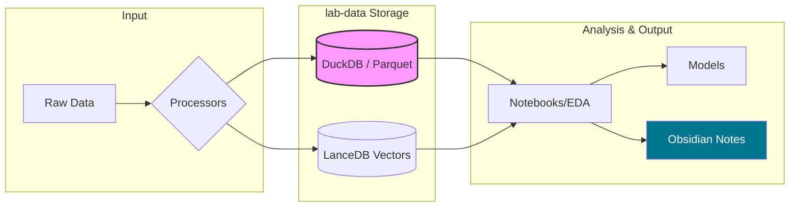

It makes a lot of sense to pivot away from OpenSearch for a personal data science lab. OpenSearch is powerful for distributed search at scale, but for a local "lab" environment, it often introduces unnecessary memory overhead and configuration complexity.

Given you are a developer and a Data Science student, your `lab-data` environment should focus on **reproducibility, speed of iteration, and ease of integration with Obsidian**.

Here is a proposed structure and stack for your new `lab-data` directory, optimised for a British English workflow and Markdown-heavy documentation.

### 1. The Directory Structure

A clean structure helps separate raw data from experimental code and final models.

```text
lab-data/
├── README.md           # Entry point and lab overview
├── data/               # .gitignore this folder if data is large
│   ├── raw/            # Immutable original data
│   ├── processed/      # Cleaned data for modelling
│   └── external/       # Third-party datasets (Kaggle, etc.)
├── notebooks/          # Jupyter or Quarto notebooks for EDA
│   ├── exploratory/    # Scratchpad and initial visualisations
│   └── final/          # Polished results
├── src/                # Reusable Python modules (cleaning, features)
│   ├── __init__.py
│   ├── data_loader.py
│   └── processors.py
├── models/             # Serialised model files (.pkl, .onnx)
├── docs/               # Obsidian-linked notes and literature reviews
├── tests/              # Pytest for your data pipelines
├── pyproject.toml      # Dependency management (Poetry or uv)
└── Makefile            # Shortcuts for common tasks (e.g., make clean)

```

---

### 2. Suggested Technology Stack

Since OpenSearch was too heavy, I recommend these "Data Lab" alternatives that are much lighter but incredibly fast:

* **Database: [DuckDB**](https://duckdb.org/)
  * *Why:* It’s the "SQLite for Analytics". It runs in-process (no server to manage), is blazingly fast on your local machine, and reads Parquet/CSV files directly. Perfect for a student lab.


* **Vector Store: [LanceDB**](https://lancedb.com/)
  * *Why:* If you still want RAG/Vector capabilities without OpenSearch, LanceDB is serverless, stores data on disk, and integrates perfectly with Python/Pandas.


* **Environment: [uv**](https://github.com/astral-sh/uv)
  * *Why:* It is an extremely fast Python package installer and resolver (written in Rust). It will save you time setting up new experiments.


* **Reporting: [Quarto**](https://quarto.org/)
  * *Why:* It’s the successor to R Markdown. It plays very well with VS Code and produces beautiful Markdown files that you can easily move into your Obsidian vault.


---

### 3. Data Flow Diagram

This Mermaid diagram illustrates how your `lab-data` would process information compared to your old `lab-code` RAG setup.



---

### 4. Integration with Obsidian

Since you use Obsidian, you can make your `lab-data` highly interactive:

1. **Direct Links:** In your Obsidian notes, use URI links to open your notebooks directly in VS Code: `[Open EDA](vscode://file/path/to/lab-data/notebooks/eda.ipynb)`.
2. **Automated Summaries:** Use a small Python script in `scripts/` that parses your `processed/` data folder and generates a `Data_Inventory.md` file inside your Obsidian vault.
3. **Canvas for Architectures:** Use Obsidian Canvas to map out your machine learning pipelines before you start coding in the lab.

### How to transition?

1. **Archive `lab-code`:** Simply move it to a folder named `_archive/lab-code` or keep it as is and create the new sibling folder.
2. **Initialise `lab-data`:** Start with the `pyproject.toml` and a `data/raw` folder.
3. **Cost Awareness:** Since you are in the UK, if you decide to use any cloud compute (like AWS SageMaker or GCP) for larger models, remember to set your billing alerts in **GBP** and keep an eye on the exchange rate, as most providers still bill natively in USD.

Does this structure align with the specific Data Science modules you are currently studying?

---

## Installation

To build and start services:

```bash
docker-compose up --build -d
```

Inside Notebook:

```Python
!uv pip install --system xgboost plotly
```

*A quick tip:*
Since you're using DuckDB in this new lab, you can query your CSV files directly using SQL inside your Python notebooks. It’s much faster than Pandas for large datasets:

```Python
import duckdb
# Query a CSV file as if it were a SQL table
results = duckdb.query("SELECT * FROM 'data/raw/uk_energy_stats.csv' WHERE price_gbp > 100").to_df()
```
