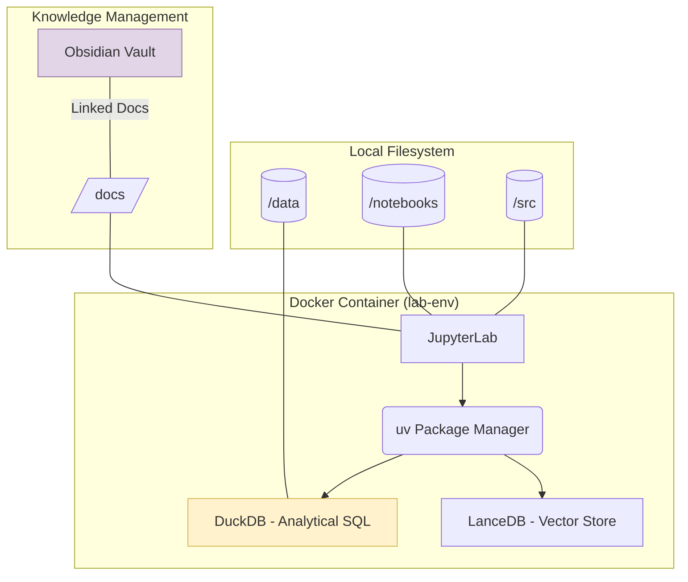

Here is a comprehensive `README.md` template designed specifically for your `lab-data` folder. It includes the setup instructions, a Mermaid diagram for the architecture, and a dedicated section for your Obsidian project log.

---

# 🧬 Data Science Lab (`lab-data`)

Welcome to the data-centric evolution of the lab. This environment has been pivoted from the original `lab-code` RAG setup to a streamlined, high-performance Data Science workbench. It prioritises local speed using **DuckDB** and **uv**, while maintaining a lightweight footprint by removing OpenSearch.

## 🏗️ Lab Architecture



## 🚀 Quick Start

### 1. Prerequisites

* **Docker & Docker Compose** installed.
* (Optional) **VS Code** with the Jupyter extension.

### 2. Initialise the Lab

From the `lab-data` directory, run:

```bash
# Build and start the container in the background
docker-compose up --build -d

```

### 3. Accessing the Environment

* **JupyterLab:** [http://localhost:8888](https://www.google.com/search?q=http://localhost:8888)
* **Data Explorer (DuckDB UI):** [http://localhost:3000](https://www.google.com/search?q=http://localhost:3000) (if profile is active)

## 🛠️ Data Science Stack

* **Engine:** [DuckDB](https://duckdb.org/) for blazingly fast SQL on Parquet/CSV.
* **Vectors:** [LanceDB](https://lancedb.com/) for serverless vector search.
* **Package Manager:** [uv](https://github.com/astral-sh/uv) (installed as `--system` inside Docker).
* **Notebooks:** Standardised JupyterLab environment with Python 3.12.

---

## 📓 Obsidian Project Log Template

*Copy the content below into a new note in your Obsidian vault to track your lab progress.*

### 📋 Lab Entry: [Project Name]

**Date:** {{date:YYYY-MM-DD}}
**Status:** 🟡 In Progress / 🟢 Completed
**Lab Path:** `lab-data/notebooks/{{title}}.ipynb`

#### 🎯 Objective

* [ ] Brief description of the data science problem.

#### 📊 Data Sources

| Dataset | Format | Source | Size |
| --- | --- | --- | --- |
| example_data | .parquet | Local/Kaggle | 150MB |

#### 🔬 Methodology

* **Cleaning:** (e.g., handling nulls in DuckDB)
* **Modelling:** (e.g., Random Forest via Scikit-learn)

#### 📝 Findings & Visualisations

> [!TIP] Integration Tip
> Use `plt.savefig('../docs/assets/plot.svg')` in your notebook to automatically update visualisations in this Obsidian note.

![[plot.svg]]

#### 💰 Cost & Resource Tracking

* **Compute:** Local Docker Lab (0.00 GBP)
* **Storage:** 2.4GB on disk.

---

## 📂 Directory Structure

* `data/`: Raw and processed datasets (ignored by git if >100MB).
* `notebooks/`: Exploratory Data Analysis (EDA) and model prototyping.
* `src/`: Reusable Python scripts and data pipelines.
* `docs/`: Markdown documentation and SVG assets for Obsidian.
* `models/`: Serialised `.pkl` or `.onnx` model files.

---

## 🧹 Maintenance

To stop the lab and clean up resources:

```bash
docker-compose down
```

To add a new library via `uv` while the container is running:

```bash
docker exec -it data_science_lab uv pip install --system <package_name>
```

---

### Pro-Tip for your Studies:

Since you're using **DuckDB**, you can keep your data in `.parquet` format within the `data/processed/` folder. It’s significantly faster than CSV and much smaller in size, which keeps your local lab efficient as your datasets grow!
